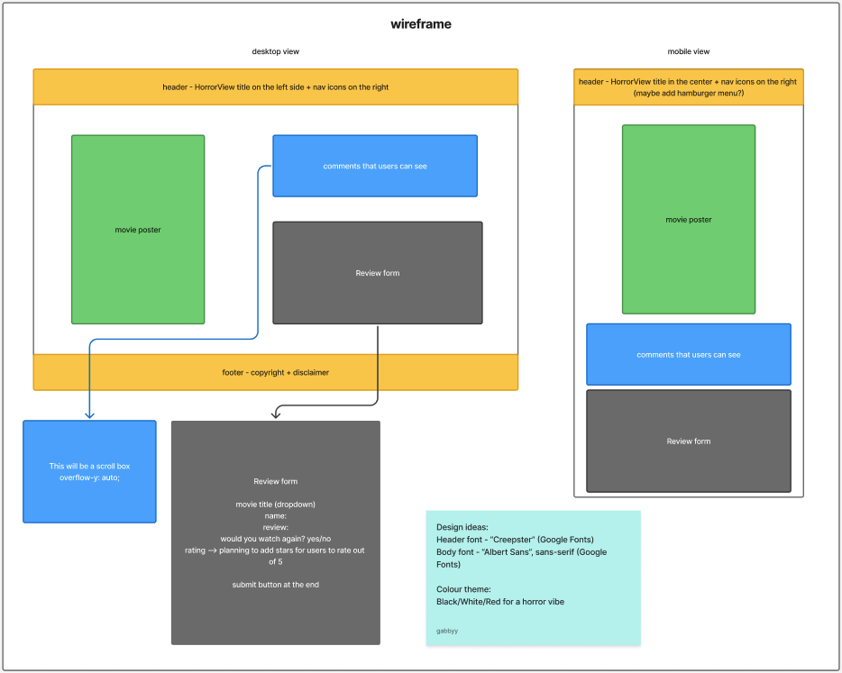

# Build a Full-Stack Guestbook

Week 4 assignment - Build a Full-Stack Guestbook

Created a movie review webpage called HorrorView as part of the Tech Educators course. 

## Requirements
- 🎯 Ensure your HTML form is working and submitting data into the database as expected. ✅
- 🎯 Confirm that your project is functional on multiple screen sizes using either Responsive Design or media queries. ✅
- 🎯 Create a working GET API route in your server. ✅
- 🎯 Create a working POST API route in your client. ✅
- 🎯 Seed your database with realistic-looking ‘dummy’ data through the Supabase query editor or a seed file in your server. Ensure that this is saved and submitted (in a screenshot or seed file form) so it can be marked and tested efficiently. ✅

## Stretch Requirements
- 🏹 Provide additional functionality on the form, for example, by adding form validation or other options. ✅
- 🏹 Style the page excellently, for example, by adding extra UX considerations or animations. ✅
- 🏹 Add a delete button to each message and a DELETE route in the server. ❌
- 🏹 Create an option for users to like others’ posts. ❌

## Reflection
For this assignment, I decided to create a movie review webpage called HorrorView. It is dedicated to users who are fans of the horror genre and can write reviews of their favourite horror films. This assignment was a blast. I really enjoyed creating a full-stack webpage and having the client, server and database connect with one another.  

Throughout the build of this webpage, I continuously checked if my database was receiving new reviews. When I was first setup the database on Supabase, I tested this in the SQL editor and can see that everything was working correctly. I did another test when I set up my server.js file using Postman. It threw a SyntaxError but it was showing status 200 - which means my data was still being sent to my database. I asked Manny about this and he did say it was how I wrote the code in Postman. Because of how it was setup in server.js, I should have added it like this:

``` 
{"formValues": {
    "movie_title": "Scream",
    "user_name": "Tom",
    "review": "Horrible movie!",
    "watch_again": "false",
    "rating": "1"
    }
} 
```

Even after doing this, I was still getting a SyntaxError but this time it was for an apostrophe. Manny said it is nothing to worry about since my data is still being sent to my Supabase database so I have left this for now. When I build my form in index.html, I regularly tested it to make sure that when I submit the review, it is still sending to Supabase. And I am happy to confirm that this is working as intended! 

There were certain things that I wanted to implement in my website. The first one was to have a hamburger menu for smaller devices. I found a really useful YouTube tutorial that helped me achieved this and I have added this to the resources. When the screen size is 768px and below, the nav bar will switch to a hamburger menu on the right side of the header. It is also interactive - when you click on it, the hamburger menu will display as an 'x' and once you click on a nav-item, it will close the menu. I also added a required attribute in my form as part of form validation. Users will be unable to submit a review without filling in the required sections. I also added a character count for the reviews so users will be able to see how much they have written. 

Throughout the website build, I used colour contrast checker to ensure the colour palette I chose has good contrast ratio for accessibility purposes. This is something I aim to keep in mind whenever I build a new project. With this assignment, to keep the horror theme, I kept a dark background colour with a white font colour. There are also hints of red in certain elements throughout the webpage to bring out the horror vibe. 

One difficulty I had was implementing the rating system on the review form. I initially used a star rating system but to match with the theme of my webpage, I decided to use ghost icons from Font Awesome. At first, the ghost icons would not render on the page and after reading through resources, I discovered that only certain icons were available for the free version. After spending a couple of hours fixing this and updating the JavaScript, the reviews are now rendered correctly with the correct rating system for my webpage. I also add interactivity for the ghost icons for when you hover over them and when you select them. 

When I was testing the submit button on my form, there was no prompt to inform me whether the submission was successful or not. Instead of ```alert()```, I wanted to do something different. I initally wanted to add a success banner that pops up to indicate whether the submit was successful or not, which would improve the users experience. However, when I played around with the code, it wasn't showing up for me when I tested it. The submit button still works and I was still receiving data to my database, but the success banner was not rendering on the page. With this failing for me, I researched online and found an alternative - ```window.location.reload()``` - which automatically refreshes the page when the submit form is successful. I have tested this and I am happy to say that this is all working perfectly. 

One thing I would have like to add is more variations of movies on the website. Maybe use an API like TMDB. But what I really wanted to focus on was completing the assignment with all the requirements needed. Which is why I kept it simple by only using one movie for the reviews. When I was testing sending data across to Supabase initially, I used different movie titles but I then filtered only reviews relevant to 'Scream' to render on the page. 

At first glance, the assignment seemed difficult to achieve. I felt overwhelmed with the idea of creating a full-stack webpage. But as I started to break down the individual requirements and with the knowledge I have gained over the past few weeks, it felt doable. Most of what I did in last week's assignment was implemented in creating HorrorView. I really enjoyed creating the back-end side of the webpage, especially since this is the first time doing it on my own as a project. Overall, this was a really exciting assignment to showcase all the skills I have gained since I started the bootcamp. I am very proud of myself with what I have been able to accomplish in such a short amount of time. 

Any feedback will be appreciated as I am always looking for ways to continuously improve.

## Wireframe
The wireframe below details the layout for both desktop and mobile view. The main purpose of the webpage is to create a seamless user experience for submitting a movie review. As you can see, there are slight differences to the webpage compared to the wireframe. I added a home content section just below the header to improve the flow of the page. The movie poster on the left with the review section and form on the right turned out really well on desktop. With the mobile view, I have the sections stacked for a clean look and better user experience. 

With the colour theme, I had to tweak the colours a little bit for better colour contrast but still matches the initial vibe I was going for, especially with the red colour. There are slight variations of red - have about three types of red, especially for hover effects. For the submit button, it is a brighter shade of red, but when users hover over it, the shade is slightly darker. My idea was to keep the colour scheme simple but play around with the variations so it still matches the horror vibe. 

<div align="center">
    
</div>

## Resources 
- https://developer.mozilla.org/en-US/docs/Web/HTML/Reference/Elements/input/radio
- https://developer.mozilla.org/en-US/docs/Web/HTML/Reference/Elements/select
- https://developer.mozilla.org/en-US/docs/Web/CSS/box-shadow
- https://developer.mozilla.org/en-US/docs/Web/HTML/Reference/Global_attributes/data-*
- https://developer.mozilla.org/en-US/docs/Web/API/Element/getAttribute
- https://developer.mozilla.org/en-US/docs/Web/API/Location/reload
- https://www.geeksforgeeks.org/javascript/word-and-character-counter-using-html-css-and-javascript/
- https://www.w3schools.com/css/css_form.asp
- https://codeworks.me/blog/how-to-reload-a-page-in-javascript/
- https://supabase.com/docs/guides/database/tables
- https://www.youtube.com/watch?v=q1xhbc-oKnc&ab_channel=CodingLab
- https://www.youtube.com/watch?v=flItyHiDm7E&ab_channel=WebDevTutorials 

## Images 
- Movie poster was from TMDB - https://www.themoviedb.org/movie/4232-scream/images/posters
- Background image for my home content section - Photo by Roel Siebrand on Unsplash

## Disclaimer
This website is created as part of a student project for educational purposes only. All movie posters, title and related images are the property of their respective copyright holders. No copyright infringement is intended. 
